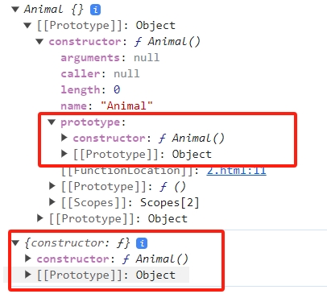

## instanceof 运算符的作用

1. 用于检测构造函数的 prototype 属性是否出现在某个实例对象的原型链上 ，返回一个布尔值:

也即是否存在构造函数的原型对象 prototype；有则返回 true，否则返回 false。

也就是说 instanceof 左边值的__proto__ 是否能找到 instanceof 右边值的 prototype，如果能找到就返回 true 。

```ts
function Animal() {};
var ani = new Animal();
console.log(ani instanceof Animal); // true
console.log(ani.__proto__ === Animal.prototype); // true
console.log(ani.constructor); //ƒ Animal() {}
console.log(Animal.constructor); // ƒ Function() { [native code] }

console.log(ani);
console.log(Animal.prototype);
```



2. instanceof 操作符可以正确的判断对象的类型:

instanceof 操作符只能正确判断引用数据类型，而不能判断基本数据类型

```ts
console.log(2 instanceof Number);                    // false
console.log(true instanceof Boolean);                // false 
console.log('str' instanceof String);                // false 
 
console.log([] instanceof Array);                    // true
console.log(function(){} instanceof Function);       // true
console.log({} instanceof Object);                   // true
```

## instanceof 的核心原理

通过检查某个对象（object）的原型链是否包含构造函数（constructor） 的原型对象。

>如果 object 的原型链中存在 constructor 的原型对象，那么 object 就是 constructor 的一个实例，返回值为 true。

>如果 obiect 的原型链中不存在 constructor 的原型对象，那么 object 就不是 constructor 的实例，返回值为 false 

## 缺点

> 由于 instanceof 是基于原型链的检查，因此如果某个对象的原型链比较深，那么检查的效率会比较低

## 手写实现 instanceof

```ts
function myInstanceof(obj, constructor) {
// 获取构造函数的原型对象（显示原型）
const prototype = constructor.prototype;

// 获取实例对象 obj 的原型（隐式原型）
// let proto = obj.__proto__;
let proto = Object.getPrototypeOf(obj);

// 循环进行查找原型 直到 Object.prototype.__proto__  === null
while (proto) {
    if (proto === prototype) {
    console.log("直接返回", "proto", proto, "prototype", prototype);
    return true;
    }
    console.log("循环查找", "proto", proto, "prototype", prototype);
    //   proto = proto.__proto__; // 重点(核心)：层层向上遍历
    proto = Object.getPrototypeOf(proto); // 重点(核心)：层层向上遍历
}
return false;
}
```

```ts
function Animal() {}
function Cat() {}
Cat.prototype = new Animal();
var cat = new Cat();

function BS() {}
BS.prototype = new Cat();
var bs = new BS();
```

>cat 是一个 Cat 的实例，因为 Cat.prototype 是 Animal 的一个实例，所以 cat 的原型链上包含Animal.prototype，从而 cat instanceof Animal 也返回true。

```ts
console.log("=== 第一组start ===");
console.log(bs instanceof BS); // true
console.log(myInstanceof(bs, BS)); // true

console.log("=== 第二组start ===");
console.log(bs instanceof Cat); // true
console.log(myInstanceof(bs, Cat)); // true
```


```ts
console.log("=== 第三组start ===");
console.log(bs instanceof Animal); // true
console.log(myInstanceof(bs, Animal)); // true

console.log("=== 第四组start ===");
console.log(cat instanceof BS); // false
console.log(myInstanceof(cat, BS)); // false
```


```ts
console.log("=== 第五组start ===");
console.log(cat instanceof Cat); // true
console.log(myInstanceof(cat, Cat)); // true

console.log("=== 第六组start ===");
console.log(cat instanceof Animal); // true
console.log(myInstanceof(cat, Animal)); // true
```


## 拓展

需要注意的是，instanceof 运算符只能用于检查对象是否是某个构造函数的实例，不能用于基本类型(如字符串、数字等)的检查。

> 如果检查的对象不是一个对象类型，instanceof 会抛出一个TypeError异常。

此外，由于 instanceof 是基于原型链的检查，因此如果某个对象的原型链比较深，那么检查的效率会比较低。

instanceof 操作符判断的是对象的原型链，因此如果一个对象是某个类的实例，那么它一定是该类的原型链上的某个对象的实例。

> 因此，如果一个对象的原型链上没有该类的原型对象，那么它就不是该类的实例，即使它与该类具有相同的属性和方法。