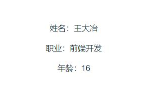
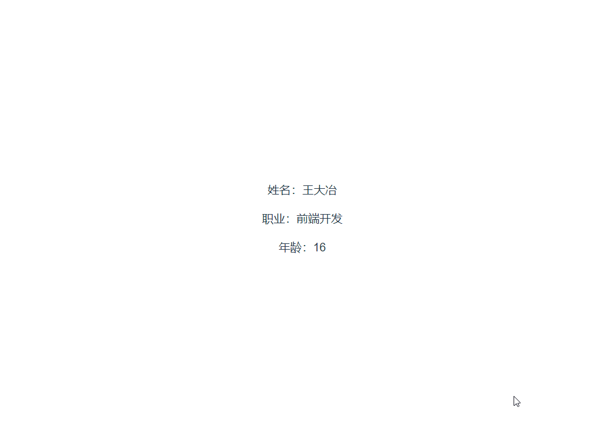

假设我们有一个显示用户信息的组件，如下所示：

```vue
<template>
  <div>
    <p>姓名：{{ name }}</p>
    <p>职业：{{ job }}</p>
    <p>年龄：{{ age }}</p>
  </div>
</template>

<script setup>
import { ref } from 'vue'

defineProps({
  name: String,
  job: String,
  age: Number,
})

const count = ref(0)
</script>
```

该组件接收三个参数，分别是 用户姓名、工作、以及年龄。在 template 中把对应的这三个字段值显示出来。

然后，在父组件中，引入 User 组件，声明一个 userInfo 对象，然后给 User 组件传入这三个参数，如下所示：

```vue
<template>
  <User :name="userInfo.name" :job="userInfo.job" :age="userInfo.age" />
</template>

<script setup>
import { reactive } from 'vue'
import User from './components/User.vue'

const userInfo = reactive({
  name: '王大冶',
  job: '前端开发',
  age: 16,
})
</script>
```

运行，效果如下：



这里有个问题，如果 User 组件不止三个参数，比如有 10、20，那我们得一个一个传，显然不怎么高效 ，那么 有什么 办法可以解决呢？

我们可以使用 v-bind 来解决这个问题，使用 v-bind 它会自动的把对象的所有属性自动绑定到组件作为 props 传递给该组件。

我们改造一下父组件，如下所示：

```vue
<template>
  <User v-bind="userInfo" />
</template>
```

运行，效果如下：


这里还有一个方法来传递大量的 props, 在子组件中使用 v-bind="$props"

如果 User 组件里有很多的事件要处理，我们也可以使用 v-on 来解决这个问题。

首先， 我们在 User 组件中自定义两个事件，当点击姓名和年龄时，向父组件发出  updateUserName，updateUserAge 事件，如下所示：

```vue
<template>
  <div>
    <p @click="handleUserName">姓名：{{ name }}</p>
    <p>职业：{{ job }}</p>
    <p @click="updateUserName">年龄：{{ age }}</p>
  </div>
</template>

<script setup>
import { ref } from 'vue'

const props = defineProps({
  name: String,
  job: String,
  age: Number,
})

const emit = defineEmits(['updateUserName', 'updateUserAge'])

const count = ref(0)

const handleUserName = () => {
  emit('updateUserName')
}
const handleUserAge = () => {
  emit('updateUserName', props.age)
}
</script>
```

在父组件中，我们接收这两个事件，并把参数打印出来：

```vue
<template>
  <User
    v-bind="userInfo"
    @updateUserName="receiverUserName"
    @updateUserAge="receiverUserAge"
  />
</template>

<script setup>
import { reactive } from 'vue'
import User from './components/User.vue'

const userInfo = reactive({
  name: '王大冶',
  job: '前端开发',
  age: 16,
})

const receiverUserName = (userName) => {
  alert(userName)
}
const receiverUserAge = (userAge) => {
  alert(userAge)
}
</script>
```

效果如下：



这里，跟上面有同个问题，如果 User 里面自定义事件很多，我们外面又懒得一个一个写，那么就可以使用 v-on 来解决这种困境：

```vue
<template>
  <User v-bind="userInfo" v-on="userEventHandlers" />
</template>

<script setup>
import { reactive } from 'vue'
import User from './components/User.vue'

const userInfo = reactive({
  name: '王大冶',
  job: '前端开发',
  age: 16,
})

const userEventHandlers = {
  updateUserName(userName) {
    alert(userName)
  },
  updateUserAge(userAge) {
    alert(userAge)
  },
}
</script>
```

这里，我们定义了一个 userEventHandlers 对象，对象的属性名就是我们 User 组件发出的自定义事件名，最后使用 v-on 绑定了  userEventHandlers。

效果如下：


