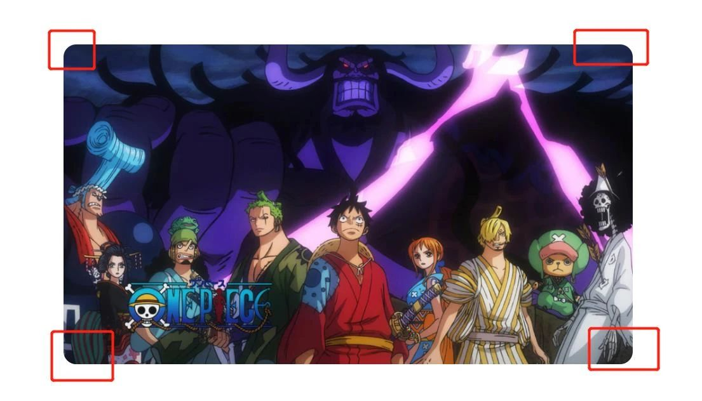
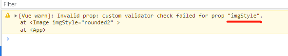

怎么将一个 props 限制在一个特定的值的集合中?

假设，我们有一个 Image 组件，内容如下：

```vue
<template>
  
</template>

<script setup>
import { ref, computed } from 'vue'

const props = defineProps({
  imgStyle: {
    type: String,
    default: 'square',
  },
})

const computeImgStyle = computed(() => {
  return {
    square: props.imgStyle === 'square',
    rounded: props.imgStyle === 'rounded',
  }
})
</script>

<style scoped>
.image {
  width: 70%;
}

.square {
  border-radius: 0;
}
.rounded {
  border-radius: 20px;
}
</style>
```

Image组件接收一个 imgStyle 参数，然后，我们用计算属性根据传入的 imgStyle 参数给 img 加圆角样式，默认是没有圆角的，如果传入的 imgStyle 值为  rounded ，我们就会给 img 加上一个 20px 的圆角。比如，我们在父组件中这样引入：

```vue
<template>
  <Image imgStyle='rounded' />
</template>

<script setup>
import Image from './components/Image.vue'
</script>
```

运行：



这会有一个小问题，就是当用户传入非 square 、rounded 的时，图片的是圆角是没有变化的，或者对应的单词拼错了，也是没有圆角的。如果用户以为此时传入的值是对的，就会有疑问，咋没效果呢？然后看控制台也没报错，这样还得花一些时间来排查。

所以，当用户传入是错误的值时，我们封装的组件能够给出提示是很重要的，那怎么判断用户传入的值是在我们的约定中呢？

这时，就可以使用 validator 属性，我们来改下 Image 的代码，如下：

```vue
...

const props = defineProps({
  imgStyle: {
    type: String,
    default: 'square',
    validator: (value) => {
      return ['square', 'rounded'].includes(value)
    },
  },
})

...
```

validator 函数接收一个参数，这个参数就是我们从父组件传进来的值，这里使用 includes 来判断，传入进来的值是否在我们数组内，如果是，则返回 true，返回没有问题，否则，返回 false，此时在控制台就会给出警告。

比如，我们在父组件中，随便传入一个值：

```vue
<template>
  <Image imgStyle='rounded2' />
</template>
```

然后，打开控制台，我们就可以发现警告了：



有了警告，用户就能快速定位到问题了。

validator 的验证，如果翻看 elementUI 或 Antd UI 库，如 Button 组件，它有几种类型像 suceess、info、danger等等，

它里面也有用到validator 的验证器，所以如果想要封装更好的组件，这个 validator是必不可少的。