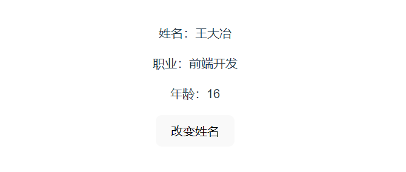
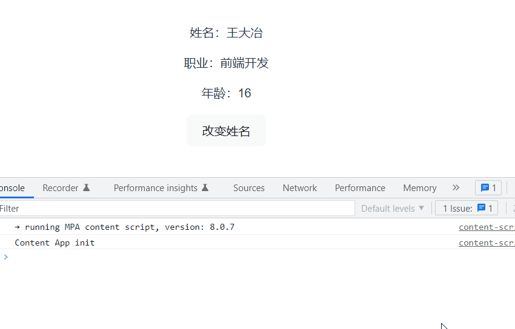
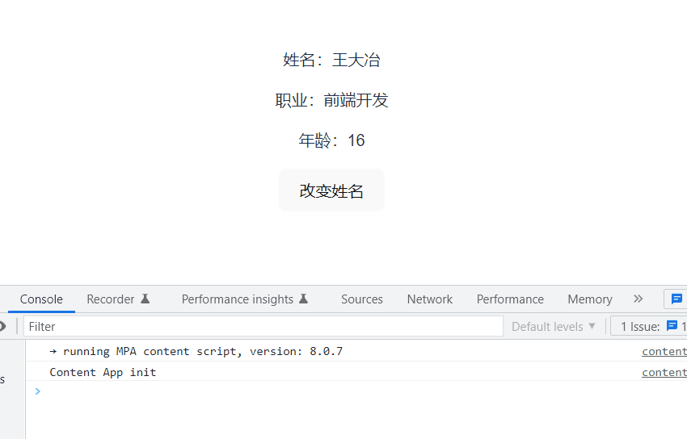
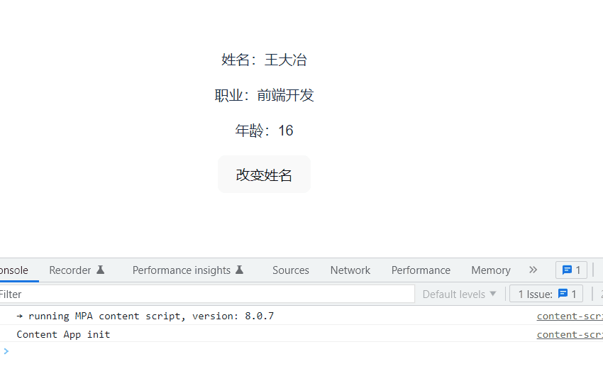

使用引号来监听对象的嵌套值的变化。是什么意思呢？

假设我们有一个 User 组件，为了说明本节的内容，这里我们使用选项API方式来写这个组件，如下所示：

```vue
// User.vue
<template>
  <div>
    <p>姓名：{{ userInfo.detail.name }}</p>
    <p>职业：{{ userInfo.job }}</p>
    <p>年龄：{{ userInfo.age }}</p>
  </div>
</template>

<script>
export default {
  props: {
    userInfo: Object
  },
}
</script>
```

User 组件接收一个参数对象 userInfo，在 userInfo 中又有一个 detail 对象，该对象包含一个 name 属性，然后，我们在 template 中把 name、job、age 展示出来。

接着， 在父组件中，我们引入 User 组件：

```vue
<template>
  <User :userInfo="userInfo" />
  <button @click="updateUserName">改变姓名</button>
</template>

<script setup>
import { reactive } from 'vue'
import User from './components/User.vue'

const userInfo = reactive({
  detail: {
    name: '王大冶'
  },
  job: '前端开发',
  age: 16
})

const updateUserName = () => {
  userInfo.detail.name = '小明'
}
</script>
```

在父组件中，我们声明了一个 userInfo0 对象，然后将该对象传递给了 User 组件。

这里当我们点击按钮时，我们在点击事件里面改变了 name 属性的值，这对大家来说都好理解。

运行：效果如下：



假设，某些场景下，在 User组件中，当传入的userInfo 对象发生变化时，我们需要做些事情。要监听对象的变化，我们可以使用 watch 来监听，但 watch 直接监听对象时，手动修改对象的某个属性值会发现，监听并没有生效，此时我们需要用到 watch 中的 deep 属性，当 deep 为 true 时它会一层层遍历给对象的所有属性都加上这个监听函数，这样可以检测到对象的每个属性变化。

```vue
export default {
  props: {
    userInfo: Object
  },
  watch: {
    userInfo: {
      handler () {
         console.log('userInfo 的值发生变化了！')
      },
      deep: true
    }
  }
}
```

运行：效果如下：



这里存在一个问题，就是我们只要监听 name 的变化而不是监听对象的所有属性变化，这时又要怎么做呢？

在 Vue3 的组合 API中，我们可以这么做：

```vue
watch(() => userInfo.detail.name, () => {
  console.log('name 发生变化了')
})
```

在选项 API 中，我们可以使用引号来监听嵌套值：

```vue
// User.vue
<script>
export default {
  props: {
    userInfo: Object
  },
  watch: {
    'userInfo.detail.name' () {
      console.log('name 发生变化了!')
    }
  }
}
</script>
```

这样在父组件更改 name 里，我们在 User 组件中就可以监听到了：



但如果在父组件中改的是非 name 字段，比如我们改的是 年龄：

```vue
const updateUserName = () => {
  userInfo.age = 22
}
```

这样在User组件中，watch是不是被触发的，因为我们只关心 name 字段。

